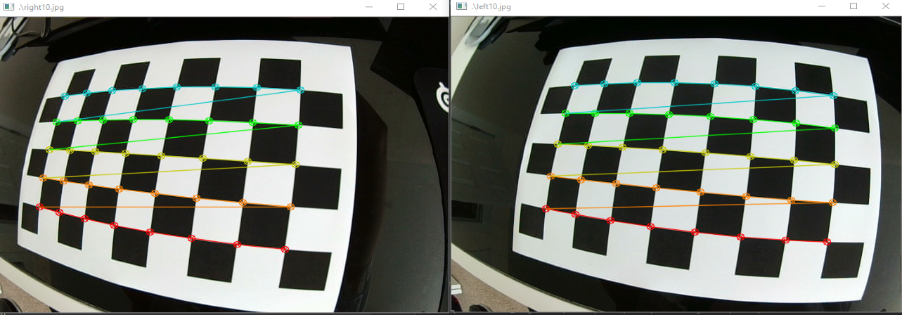

# Stereo-Camera-Calibration
This is for calibrating stereo camera systems with radial or barrel lens distortion, and returning a corrected image with no distortion. To do so, you must take pictures of a 9x6 checkerboard (8x5 vertices) at various positions with uncalibrated_camera.py. Other board dimensions work, but values must be changed accordingly. 

# uncalibrated_camera.py
This file opens the camera as it is, with distortion present in order to take images that will be calibrated later to create the calibrated video as well as to create a depth map. Press 'q' to quit and 's' to take a picture.

# fundamental_matrix.py
After taking several pictures (10 or more) with uncalibrated_camera.py, run this to generate the fundamental matrixes for the left and right cameras. Then the subsequent values
will be saved in a npz file for use in calibrated_camera.py.

# calibrated-camera.py
calibrated_camera.py shows the undistorted live video from the camera, and allows you to take calibrated pictures. It does so by taking the matrix values from fundamental_matrix.py and corrrecting them.

# depth_map.py
select 2 calibrated pics (taken with c-c.py) and generates a depth map based on them.

